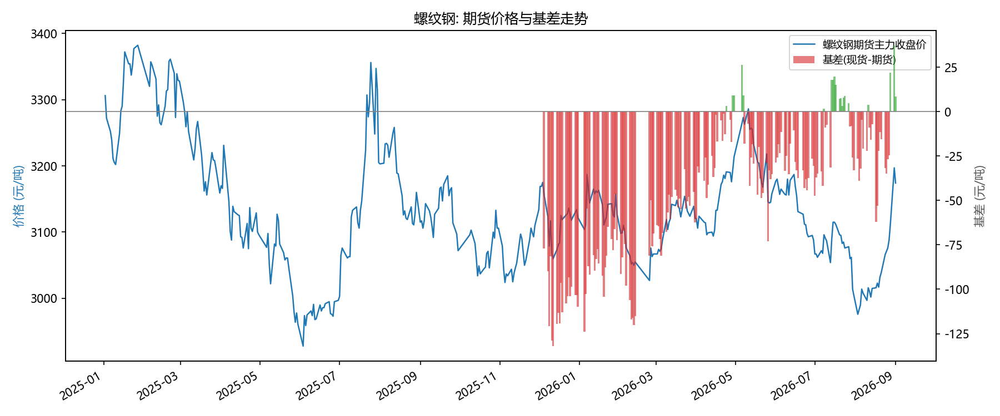
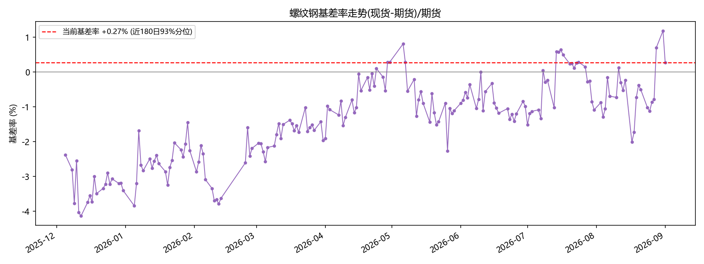
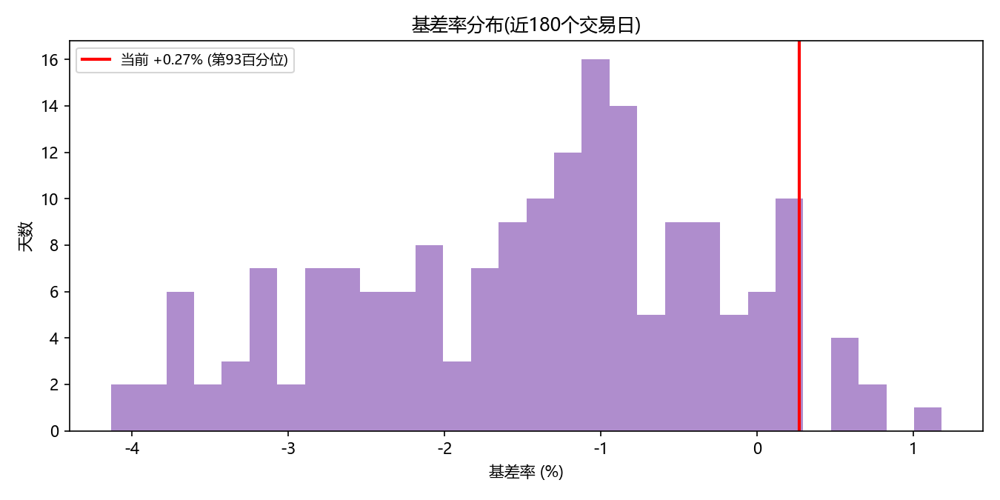
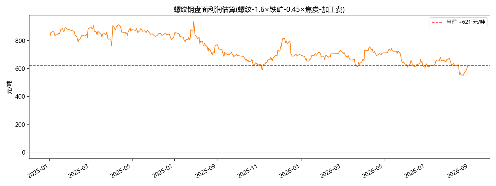
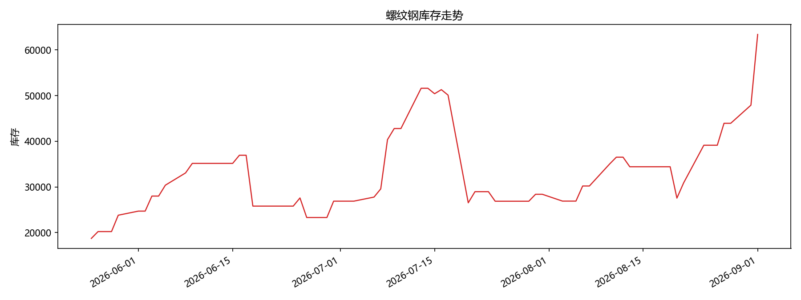
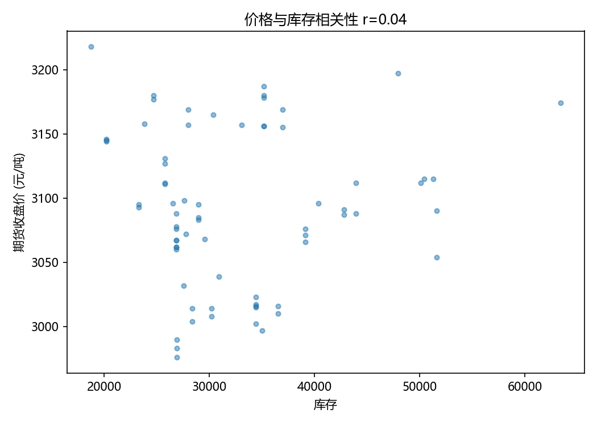
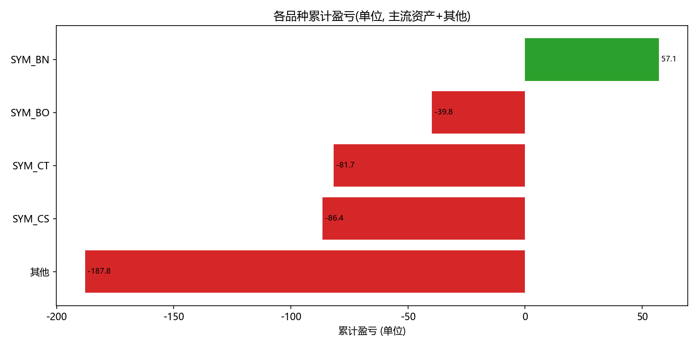

# Trade Performance Analysis

对个人衍生品实盘交易记录(821个完整仓位)进行绩效归因分析的项目,含FXReplay系统化回测复盘。

## 项目背景

独立实盘交易者,以价格行为(Price Action)体系为核心进行市场结构分析。
本项目用 Python(pandas + matplotlib + pyecharts)对 19 个月的真实交易记录进行系统性统计分析,
以数据发现交易问题并驱动策略迭代。

项目主线:先付出真实学费(前期高频乱做、爆仓3次、亏损集中),再通过数据归因把
"亏在哪里、为什么亏、改进是否生效"逐项量化——月均亏损收窄87%、盈亏比自0.39修复至0.79、
手续费绝对额下降93%、重建纪律后连续19个月零爆仓;改进不是赌出来的,而是归因+验证出来的。

## 项目结构

```
trade-performance-analysis/
├── trade_analysis.py      基础绩效统计(胜率/盈亏比/品种归因) + 4张静态图
├── make_report.py         交互式HTML分析报告(pyecharts)
├── deep_analysis.py       深度分析(回撤/连亏/星期效应/时段效应)
├── position_analysis.py   完整仓位级分析(开平配对/资金费用/真实持仓时长)
├── fxreplay_analysis.py   FXReplay回测复盘归因(独立数据交叉验证)
├── progress_analysis.py   阶段对比(2025上半年 vs 2026)
├── rolling_analysis.py    滑动窗口分析(近1月/3月/半年/1年)
├── data_sample.csv        脱敏样本数据(历史仓位前60条,格式参考)
├── position_sizer/        仓位管理工具(风险预算+手续费建模+强平预警)
├── report.html            交互式报告成品
└── requirements.txt       依赖清单
```

## 数据来源

- 境外合规交易所实盘导出数据(2025-01 ~ 2026-08):成交明细 / 历史仓位 / 历史委托 / 资金流水
- 成交明细 2394 条,完整仓位 821 个,交易标的为跨资产类别的保证金合约(含贵金属类合约)
- **展示名脱敏**:为保护个人交易信息公开性,品种展示名统一映射为中性代号(如 SYM_XX),
  贵金属/能源类合约(如黄金/白银/原油)保留品类真名,映射逻辑见 `anonymize.py`
- **数据与隐私说明**:完整原始导出数据不随仓库公开(避免泄露个人完整交易记录),仅保留聚合统计结果;
  仓库提供脱敏样本 [data_sample.csv](data_sample.csv)(历史仓位表前60条)供数据格式参考,
  所有分析代码均可复现,如需核验完整数据可在面试时现场演示分析流程。

## 核心发现

| 指标 | 数值 |
|------|------|
| 仓位盈亏(完整配对口径) | -427.42 单位 |
| 手续费+资金费用 | -204.36 单位(占亏损约 48%) |
| 仓位胜率 | 47.1%(387盈 / 434亏) |
| 盈亏比 | 0.54(平均盈利 +1.01 / 平均亏损 -1.89) |
| 持仓时长 | 中位数 0.4 小时(75%仓位不足1小时,超短线) |
| 做多 vs 做空 | 做多 -398 / 做空 -29 |
| 盈亏因子 | 0.57 |

### 数据揭示的核心问题

1. **盈亏比失衡是亏损主因**:胜率接近五五开(47.1%),但盈利单持有不足(赚小亏大),
   平均盈利仅为平均亏损的 54%
2. **过度交易成本高**:手续费+资金费用占亏损约 48%,持仓中位数仅 0.4 小时(75%仓位不足1小时)
3. **方向性差异显著**:做空仅亏 -29 单位,做多亏 -398 单位,逆势做多是主要亏损来源

### 深度分析发现(deep_analysis.py)

| 维度 | 发现 |
|------|------|
| 最大回撤 | -58.75 单位(月度累计净值) |
| 连续亏损 | 最长连续亏损 17 笔,未失控(风控纪律有效) |
| 单笔期望 | -0.29 单位(负期望,问题明确) |
| 星期效应 | 周二亏损最多(-159 单位,206笔),周五盈利(+30) |
| 时段效应 | 0时盈利最多(+55),16时(收盘后)亏损最多(-72) |
| 持仓时长 | 中位数 0.4 小时(超短线,75%仓位不足1小时) |
| 盈亏比敏感性 | 盈亏比提升至1.5 → 总盈亏从 -338 改善至 -118(亏损减少65%) |

**关键结论**:盈亏比(盈利单持有)与交易时段选择是可量化的改进方向,
改进模拟显示修复盈亏比可使亏损降低 65%,这是后续迭代的核心目标。

## 滑动窗口分析(rolling_analysis.py)

用滑动时间窗口(近1月/3月/半年/1年)追踪指标演进,区分"历史问题"与"当前状态"。

| 窗口 | 笔数 | 胜率 | 盈亏比 | 盈亏(单位) |
|------|------|------|--------|-----------|
| 近1个月 | 66 | 50.0% | 0.45 | -12.2 |
| 近3个月 | 186 | 45.7% | 0.76 | -18.6 |
| 近半年 | 419 | 42.2% | 0.75 | -40.3 |
| 近1年 | 478 | 43.3% | **0.79** | -46.1 |
| 全部 | 821 | 47.1% | 0.53 | -427.4 |

**关键结论**:总亏损的89%集中于2025上半年(高频乱做期),
近一年盈亏比已从0.53修复至0.79,亏损收窄89%——体系改善是真实的、可量化的。


## 成本结构演进(手续费占比)

过度交易(手续费侵蚀利润)是否改善,是验证迭代效果的另一个指标。

| 阶段 | 笔数 | 手续费(单位) | 盈亏(单位) | 手续费/亏损 |
|------|------|------------|-----------|------------|
| 2025上半年 | 317 | -183.7 | -395.6 | 46.4% |
| 2026年 | 468 | -14.0 | -50.5 | 27.8% |
| 近3个月 | 197 | -6.6 | -18.3 | 36.2% |

**结论**:交易频率大幅下降(月均笔数53→26),手续费绝对额下降93%,
手续费占亏损比例从46.4%降至27.8%——过度交易问题得到系统性改善。
该指标纳入日常监控(近3个月略有回升,持续跟踪调整)。

## 进步轨迹分析(progress_analysis.py)

按时间段切分 821 个仓位,验证交易体系的迭代改进(研究闭环的最后一块)。

| 指标 | 2025上半年 | 2026年 | 变化 |
|------|-----------|--------|------|
| 胜率 | 50.5% | 42.7% | 略降 |
| **盈亏比** | **0.39** | **0.74** | **接近翻倍** |
| 持仓时长(中位数) | 0.2 小时 | 0.6 小时 | 盈利单持有改善 |
| 做空占比 | 49.2% | 61.1% | 向数据证明有效的方向调整 |
| 单月平均亏损 | -395 单位 | -50 单位 | 亏损收窄87% |

**迭代闭环**:2025上半年高频交易、盈亏比0.39、亏损集中 →
数据复盘识别核心问题(盈利单拿不住+逆势做多) →
降低频率、延长持仓、转向做空 →
2026年盈亏比翻倍至0.74,单月亏损从-334收窄至-12。

**结论**:亏损收窄源于可量化的策略调整,而非运气;数据驱动的改进闭环仍在持续。


## FXReplay 系统化回测复盘(fxreplay_analysis.py)

基于 FXReplay 回放工具对价格行为体系进行系统化验证,33 笔完整记录
(每笔含市场背景、形态、信号质量、入场/止损/出场、MFE/MAE、Review)。

| 指标 | 数值 |
|------|------|
| 样本 | 33 笔(持续扩充中) |
| 胜率 | 57.6%(19胜 / 14负) |
| 总盈亏 | +5.06R(正期望) |
| 平均MFE(R) | 1.77 vs 实际兑现 0.153(兑现率8.7%) |

**关键发现**:
1. **形态归因**:双顶(Double Top)+5.96R、楔形(Wedge)+3.13R 为有效形态;L2(-3.02R)、双底(-3.05R)为亏损来源
2. **市场背景**:趋势(18笔)+3.88R、突破模式(5笔)+3.06R 为正;震荡市(10笔)-1.87R 为负
3. **方向归因**:做空 +9.14R vs 做多 -4.07R —— 与实盘 821 仓位结论一致(空优于多)
4. **MFE 兑现率仅 8.7%**:平均理论盈利 1.77R 只兑现 0.15R,与实盘"盈利单拿不住"问题互相印证,
   两份独立数据集指向同一核心缺陷


## 黑色系商品研究(black_series.py / make_black_report.py)

针对大宗商品贸易岗位的实战研究:以螺纹钢为例,建立"期货价格+现货基差+库存+盘面利润"的多维基本面跟踪框架。
**本次数据截至 2026-09-01**(数据源:akshare,可随时重跑更新)。

| 指标 | 数值 | 解读 |
|------|------|------|
| 期货主力收盘 | 3174 元/吨 | 自8月中旬3016反弹至3174(+5%),价格回升 |
| 最新基差 | +8 元/吨 | 由8月中旬的-62转为现货升水,基差修复至平水附近 |
| 基差率 | +0.27% | 处于近180日93%分位(偏高)——深度贴水阶段已过去 |
| **基差率历史分位** | **近180日93%分位** | 三个月前从86%→36%回落,本次重新升至93%,基差结构反复切换 |
| 库存 | 63401 | 近30日累库 +36507(去库转累库,库存加速累积) |
| 价格-库存相关性 | r=0.04 | 相关性由0.49降至0.04,价格与库存表观脱钩(涨价与累库并存) |
| **盘面利润** | +621 元/吨 | 维持偏高水平,钢厂增产动力强 |

**期现正套损益测算(含资金成本,年化4.5%)**:当前基差 +8(现货贴水已修复),30天持有资金成本约10.9元/吨,
盈亏平衡基差约+19元/吨——基差已修复至平水附近,正套空间收窄,当前性价比窗口关闭(S2止盈/离场区)。

**跟踪信号表**:以"基差分位 + 库存拐点 + 盘面利润"三维触发,
当前 S2收敛止盈、S5增产压力已触发(S1正套观察、S3正套风险未触发)。

**研究结论**:8月中旬至9月初框架捕捉到第二次市场状态切换——基差-62→+8(深贴水→现货升水收窄)、
分位36%→93%、库存加速累库(+36507/30日)但价格反弹(+158),典型的"涨价与累库并存"背离结构,
反映现货端涨价与贸易商补库行为交织。**框架的价值在动态跟踪**:结论是动态的,框架是常驻的——
基差已修复至高位分位,正套窗口关闭,当前等待库存拐点与基差重新走弱后再评估。
交互式报告见 [black_series/black_series_report.html](black_series/black_series_report.html)。








## 图表

> 交互式动态报告(鼠标悬停查看数据): **打开 [report.html](report.html) 查看**

| 图表 | 说明 |
|------|------|
| `1_monthly_equity.png` | 月度累计净盈亏曲线 |
| `2_pnl_distribution.png` | 单笔盈亏分布 |
| `3_symbol_pnl.png` | 各品种盈亏归因 |
| `4_direction_pnl.png` | 多空方向盈亏对比 |





## 相关工具:仓位计算器(position_sizer/)

自研仓位管理工具(Python CLI,零依赖):按固定比例风险预算反推每笔仓位,
纳入双边手续费、合约最小步进与强平距离检查,将"单笔风险1%-2%"的纪律工具化。
核心公式与使用说明见 [position_sizer/README.md](position_sizer/README.md)。

## 运行方式

```bash
pip install -r requirements.txt
python trade_analysis.py       # 生成静态图表
python make_report.py          # 生成交互式HTML报告
python deep_analysis.py        # 深度分析(回撤/连亏/星期效应/时段效应)
python position_analysis.py    # 完整仓位级分析(开平配对/资金费用/持仓时长)
python fxreplay_analysis.py    # FXReplay回测复盘归因分析
python progress_analysis.py    # 进步轨迹分析(胜率/盈亏比演进)
python rolling_analysis.py     # 滑动窗口分析(近1月/3月/半年/1年)
python fee_analysis.py         # 成本结构演进(手续费占比)
python black_series.py         # 黑色系:螺纹钢基差+库存分析
python make_black_report.py    # 黑色系交互式报告
```

## 技术栈

Python 3.12 / pandas / matplotlib / pyecharts / akshare / CSV
